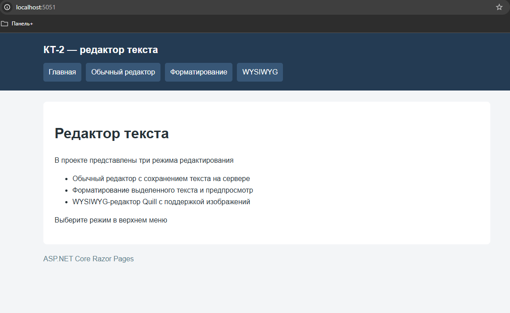
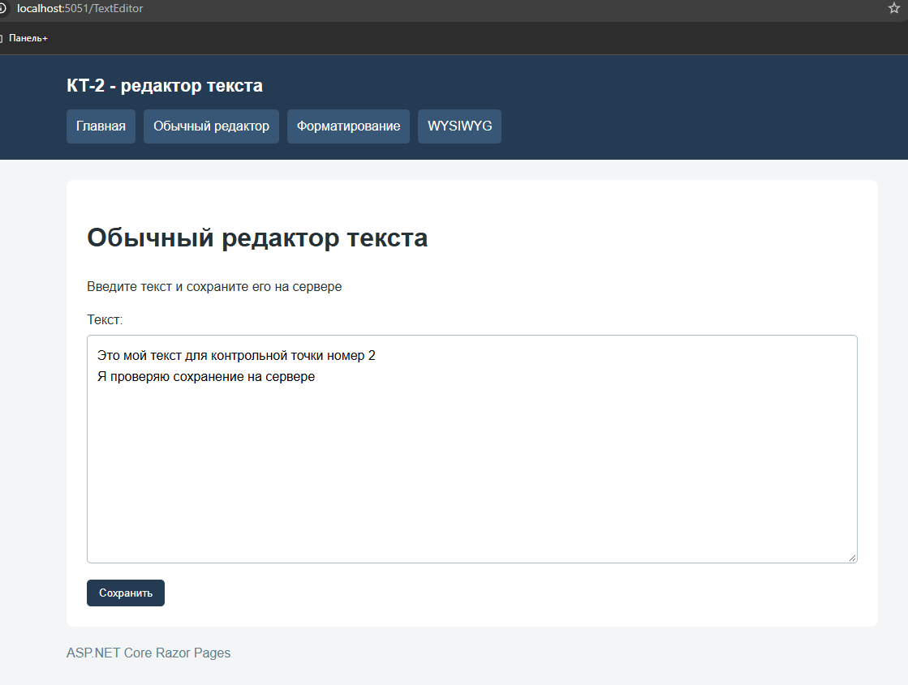
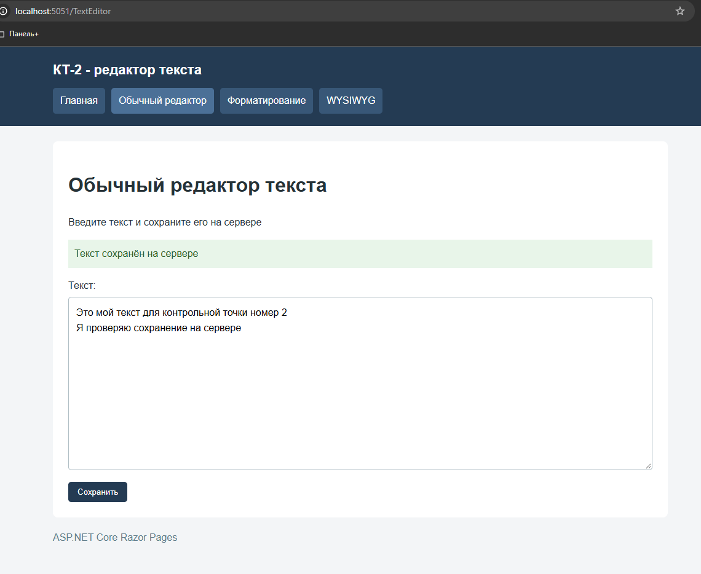
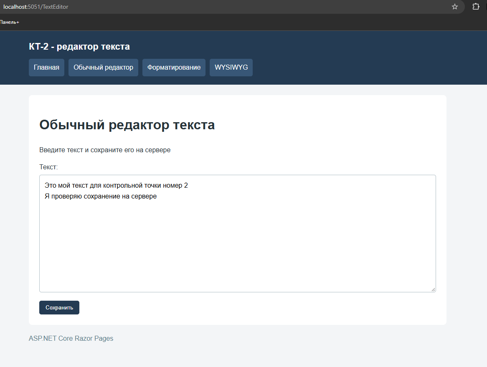
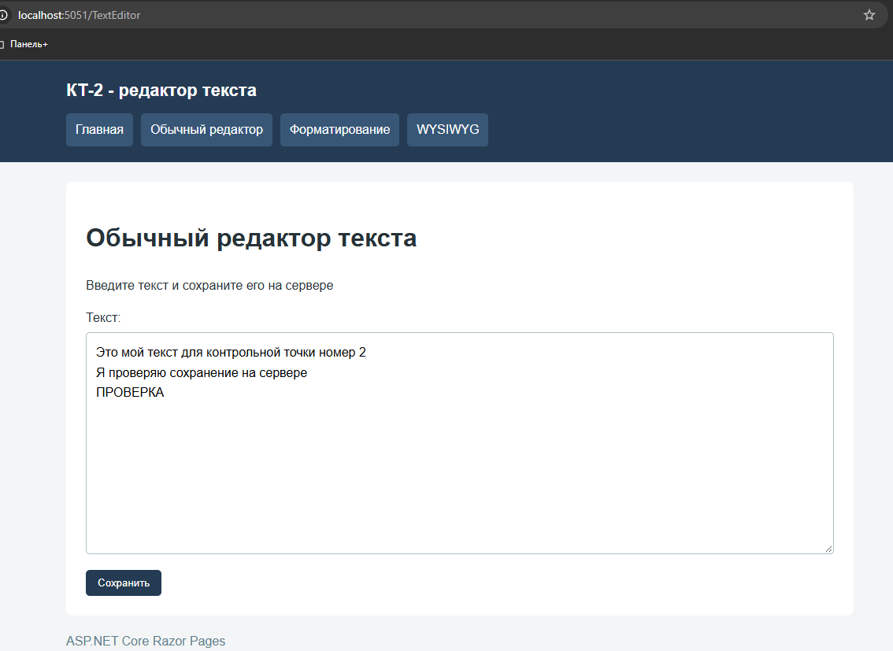
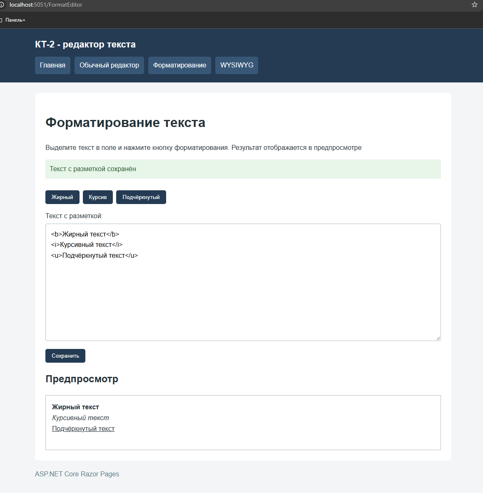
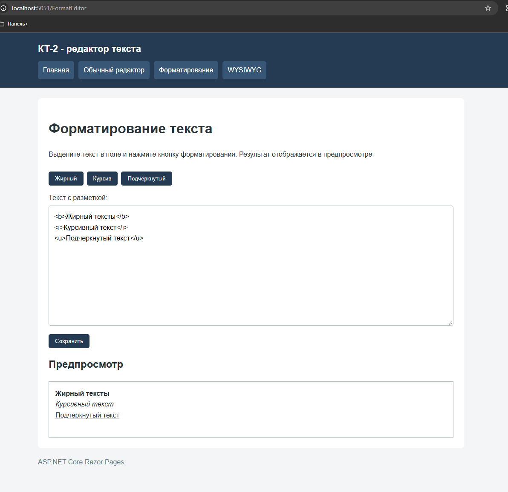
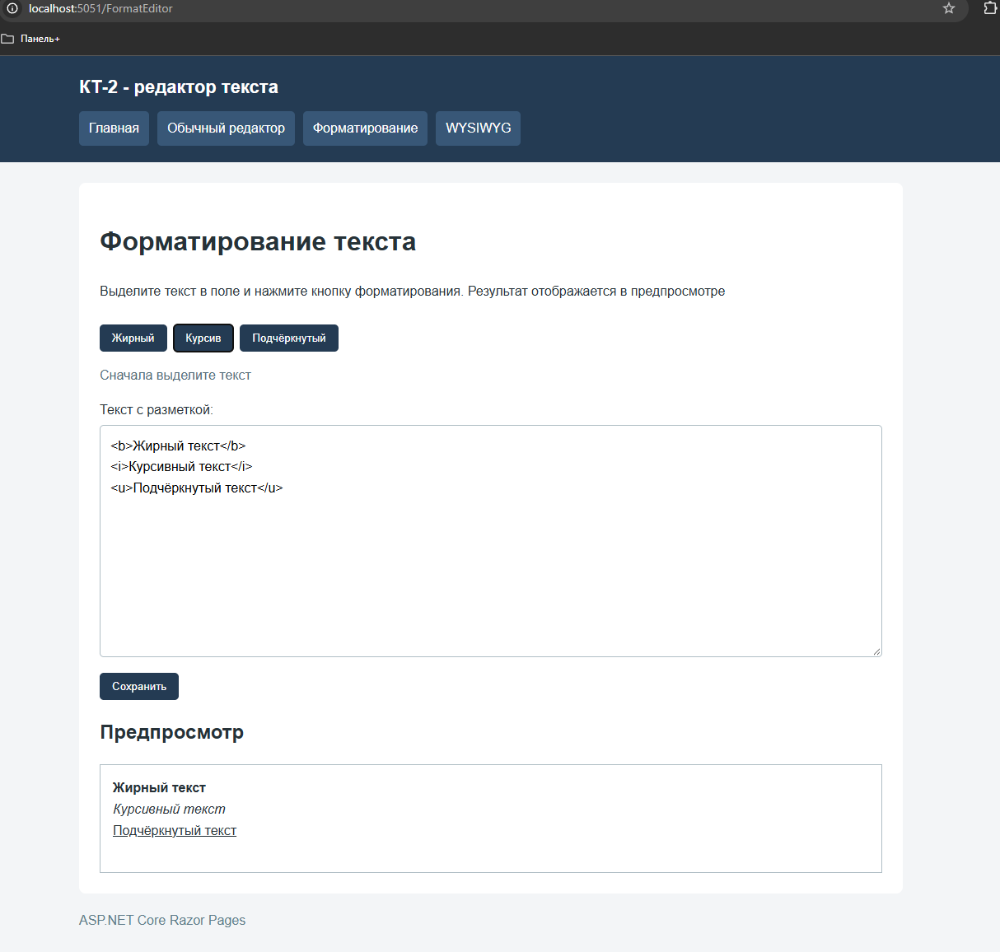
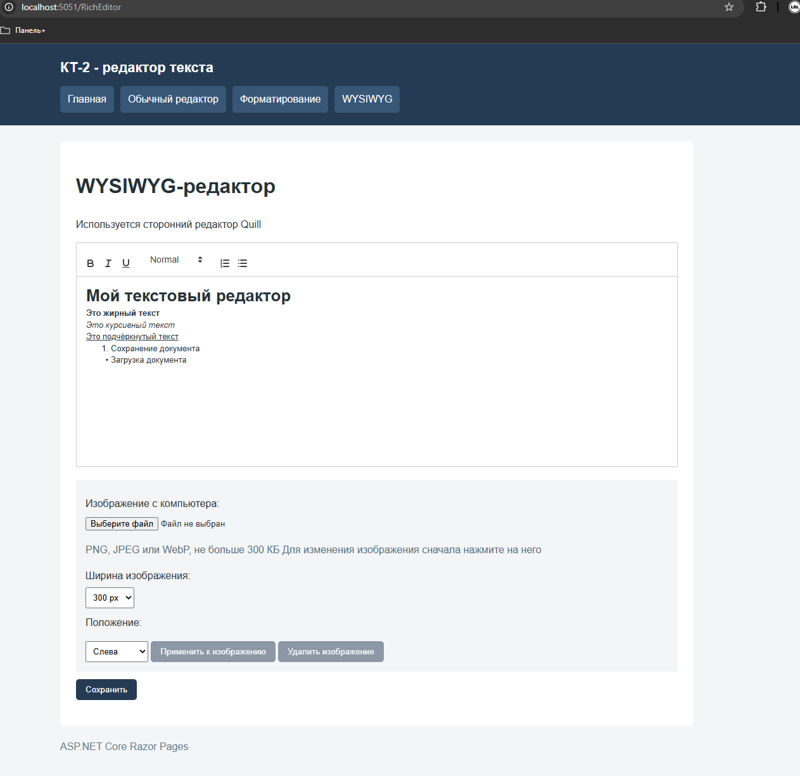
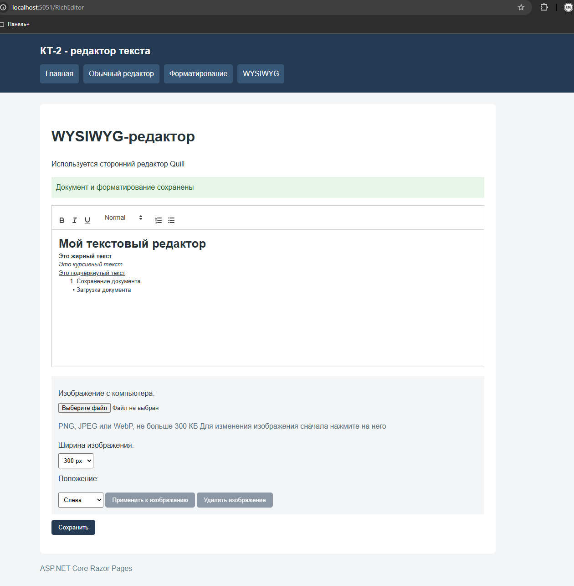

# КТ-2. Редактор текста

Студент - Денисенко Даниил Евгеньевич  
Группа - 4п4.23 NET  
Дисциплина - ADO.NET  

### Задания

Задание 1. Редактор текста

Цель: Разработать веб-страницу, которая позволяет пользователю редактировать текст прямо в браузере.
Задачи:
Создайте новый проект ASP.NET Core - шаблон "Web Application" для Razor Pages.Разработайте форму с текстовым полем (<'textarea'>), в котором пользователь может ввести или изменить текст.Добавьте кнопку "Сохранить", при нажатии на которую текст из текстового поля сохраняется на сервере (можно сохранять в файл или в памяти приложения).Реализуйте возможность загрузки ранее сохраненного текста в текстовое поле при открытии страницы.

Задание 2. Форматирование текста

Цель: Добавить функциональность для форматирования текста в редакторе (жирный, курсив, подчеркнутый).
Задачи:
Расширьте интерфейс редактора, добавив кнопки для применения стилей к выделенному тексту: жирный, курсив, подчеркнутый.Используйте JavaScript для реализации функциональности кнопок, изменяющих стиль текста в <'textarea'>.Обеспечьте сохранение форматированного текста с возможностью его последующей загрузки и корректного отображения.

Задание 3.

Цель: Интегрировать в проект сторонний WYSIWYG (What You See Is What You Get) редактор для более сложного форматирования текста.
Задачи:
Выберите подходящий WYSIWYG редактор (TinyMCE или другой).Интегрируйте выбранный редактор в вашу веб-страницу вместо простого <'textarea'>.Реализуйте сохранение и загрузку контента, созданного с помощью WYSIWYG редактора, обеспечивая сохранение форматирования.

### ЗАДАНИЕ 1:

На главной странице перечислены режимы редактора.
Общее меню позволяет перейти к обычному редактору,
форматированию текста и WYSIWYG-редактору

Пользователь вводит многострочный текст в textarea.
На скриншоте показано содержимое до сохранения

После нажатия «Сохранить» текст записывается на сервере
в файл App_Data/text.txt. Отображается сообщение
об успешном сохранении

После перехода на другую страницу и повторного открытия
редактора ранее сохранённый текст загружается в поле

Обработчик OnGet читает файл, а OnPost сохраняет
отправленное значение свойства EditorText

Ранее сохранённый текст изменён и сохранён повторно.
После нового открытия страницы отображается обновлённая версия

### ЗАДАНИЕ 2

Реализованы кнопки «Жирный», «Курсив» и «Подчёркнутый».
JavaScript получает выделенный участок текста и добавляет
теги b, i или u

Обычный textarea отображает простой текст, поэтому разметка
показывается в поле, а её визуальный результат — в предпросмотре

Текст вместе с разметкой сохраняется в App_Data/formatted.txt.
После повторного открытия страницы восстанавливаются
разметка и корректное отображение в предпросмотре

Если текст не выделен, кнопка не изменяет содержимое.
Пользователю предлагается сначала выделить текст

### ЗАДАНИЕ 3

В проект интегрирован сторонний редактор Quill 2.0.3.
Форматирование видно непосредственно в области редактирования

Проверены жирное, курсивное и подчёркнутое начертания,
заголовки и списки

Документ сохраняется на сервере в App_Data/rich.json
в формате Quill Delta

При отправке формы вызывается getContents(), а при загрузке
сохранённого документа — setContents().
После повторного открытия страницы оформление сохраняется

После остановки и повторного запуска приложения документ
загрузился с прежним текстом и форматированием

Данные хранятся в файле на сервере и не зависят
от времени работы процесса приложения